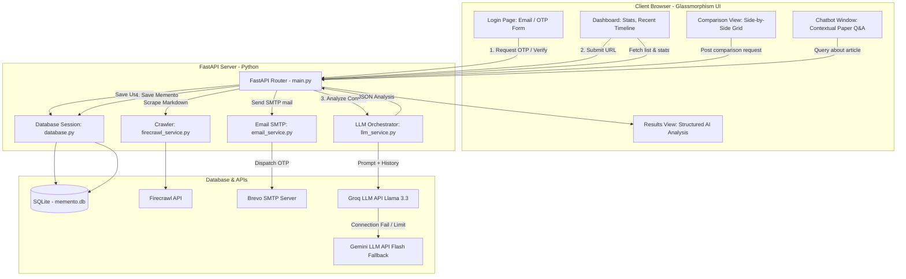

# ResearchFlow AI 🧠✨
### *Analyze. Compare. Evolve.*

ResearchFlow AI is a modern, generative AI-powered research synthesis dashboard. It helps researchers, developers, and students instantly digest academic publications and technical web pages. By combining automated web scraping, intelligent prompt structuring, and dual-model LLM inference, the platform parses complex research content into structured summaries, builds comparative matrices, and hosts conversational Q&A sessions.

---

## 🗺️ System Architecture & Workflow

The diagram below outlines the end-to-end data flow and technology stack:



---

## 🚀 Key Features

*   **Secure Passwordless Authentication**: Enter your email to receive a secure 6-digit transactional verification code (OTP) via SMTP (Brevo) valid for 10 minutes.
*   **Web & Paper Scraper**: Uses **Firecrawl** to clean web pages and PDF links into pure Markdown text, stripping away advertisement wrappers and headers.
*   **Structured AI Analysis**: Extracts the core problem, methodology, empirical findings, final conclusions, a list of key contributions, and critical research gaps.
*   **Evolutionary Context**: Feeds previously analyzed articles to the LLM when adding a new paper, establishing comparative trends and historical context automatically.
*   **Interactive Comparison Grid**: Select two or more papers to generate a comparative analysis across overview, methodology, results, contributions, evolution, and research gaps.
*   **In-Context Research Chat**: Open the chatbot panel on any paper page to query the AI assistant specifically on the content, math, or methodology of that target paper.
*   **Aesthetic UI**: Custom-built dashboard with floating glassmorphism modules, real-time stats cards, custom particle animations, typewriter transitions, and light-speed scrolling interfaces.

---

---

## 🔧 Installation & Setup

Follow these steps to run the complete stack locally:

### 1. Prerequisites
Make sure you have **Python 3.10+** installed on your machine.

### 2. Clone and Setup Environment
Navigate to the project root directory and create a virtual environment:
```bash
# Create virtual environment
python -m venv venv

# Activate virtual environment
# On Windows (PowerShell):
.\venv\Scripts\Activate.ps1
# On Linux / macOS:
source venv/bin/activate
```

Install all backend dependencies:
```bash
pip install -r requirements.txt
```

### 3. Configure Variables (`.env`)
Create a `.env` file in the root directory (matching the repository structure) and fill in your keys:
```env
FIRECRAWL_API_KEY=your_firecrawl_api_key_here
GEMINI_API_KEY=your_gemini_api_key_here
GROQ_API_KEY=your_groq_api_key_here

EMAIL_HOST=smtp-relay.brevo.com
EMAIL_PORT=587
EMAIL_USER=your_smtp_username_here
EMAIL_PASS=your_smtp_password_here
SENDER_EMAIL=sender@example.com
```

### 4. Run the Server
Launch the FastAPI server using Uvicorn. The backend database tables in `memento.db` will automatically initialize if they don't exist:
```bash
uvicorn backend.main:app --reload
```

The terminal should output:
`INFO:     Uvicorn running on http://127.0.0.1:8000 (Press CTRL+C to quit)`

### 5. Access the Web App
Open your browser and navigate to:
👉 **[http://localhost:8000](http://localhost:8000)**

You will be redirected to `login.html` to enter your email and authenticate via the SMTP email OTP sequence.

